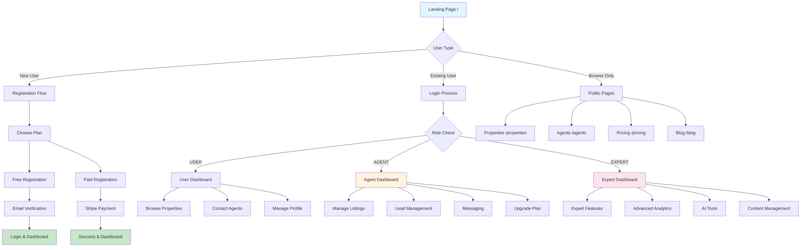

# 🗺️ Route Architecture & Component Map

## Navigation Flow Architecture



## 📁 File Structure Map

```
src/app/
├── 🏠 Public Routes (No Auth Required)
│   ├── page.tsx                    # Landing/Home page
│   ├── properties/page.tsx         # Property search & listings
│   ├── agents/page.tsx             # Agent directory
│   ├── blog/page.tsx               # Marketing blog/content
│   ├── pricing/page.tsx            # Pricing plans display
│   ├── register/page.tsx           # Multi-step registration
│   ├── reset-password/page.tsx     # Password reset form
│   └── verify-email/page.tsx       # Email verification
│
├── 🔒 Protected Routes (Auth Required)
│   ├── dashboard/page.tsx          # Role-based main dashboard
│   ├── profile/page.tsx            # User profile management
│   ├── settings/page.tsx           # Account settings
│   └── upgrade-success/page.tsx    # Post-payment success
│
├── 👨‍💼 Agent/Expert Routes (Role Required)
│   └── add-listing/page.tsx        # Property listing creation
│
├── 🎯 Expert Only Routes
│   └── expert/
│       ├── dashboard/page.tsx      # Expert-specific dashboard
│       ├── blog/page.tsx           # Blog management tools
│       └── social/page.tsx         # Social media management
│
├── 🚀 Advanced Features (Demo/Future)
│   ├── ai-matching/page.tsx        # AI property matching
│   ├── invest/page.tsx             # Investment platform
│   ├── rewards/page.tsx            # Rewards system
│   ├── community/page.tsx          # Community features
│   └── forecast/page.tsx           # Market forecasting
│
├── 🧪 Development/Testing
│   └── test-page/page.tsx          # Component testing
│
└── 🔌 API Routes (Backend)
    └── api/
        ├── auth/                   # Authentication endpoints
        ├── listings/               # Property management
        ├── leads/                  # Lead management
        ├── conversations/          # Messaging system
        ├── messages/               # Message handling
        ├── stripe/                 # Payment processing
        ├── packages/               # Subscription plans
        └── health/                 # System monitoring
```

## 🎨 Component Architecture

### Page Components Structure

#### 1. Landing Page (`/`)
```typescript
HomePage {
  // Hero section with search
  HeroSection {
    PropertySearchForm
    AIAssistantDialog
    ManualSearchFlow
  }
  
  // Feature showcase
  FeaturesSection {
    FeatureCard[]
    StatisticsDisplay
  }
  
  // Authentication
  AuthenticationSection {
    LoginDialog
    RegisterDialog
    ForgotPasswordDialog
  }
  
  // Footer
  FooterSection
}
```

#### 2. Properties Page (`/properties`)
```typescript
PropertySearchPage {
  // Search and filters
  SearchHeader {
    SearchInput
    FilterDialog {
      PriceRangeFilter
      LocationFilter
      PropertyTypeFilter
      FeatureFilters
    }
    ViewToggle // Grid/List
  }
  
  // Results
  PropertyGrid {
    PropertyCard[] {
      ImageCarousel
      PropertyDetails
      AgentInfo
      ActionButtons // Save, Share, Contact
    }
  }
  
  // Pagination
  PaginationControls
}
```

#### 3. Agent Directory (`/agents`)
```typescript
AgentsPage {
  // Search and filters
  AgentSearchHeader {
    SearchInput
    LocationFilter
    SpecialtyFilter
    ExperienceFilter
  }
  
  // Agent listings
  AgentGrid {
    AgentCard[] {
      AgentProfile
      Statistics
      Specialties
      ContactButton
      ViewListingsButton
    }
  }
  
  // Agent detail modal
  AgentDetailModal {
    AgentProfile
    PropertyListings
    Reviews
    ContactForm
  }
}
```

#### 4. Registration Flow (`/register`)
```typescript
RegisterPage {
  // Multi-step wizard
  RegistrationWizard {
    Step1: PlanSelection {
      PlanCards[]
      ComparisonTable
    }
    
    Step2: UserInformation {
      PersonalDetailsForm
      AgentDetailsForm // if agent/expert
    }
    
    Step3: PaymentProcessing {
      StripeCheckout // for paid plans
      EmailVerification // for free plans
    }
    
    Step4: Welcome {
      SuccessMessage
      NextStepsGuidance
    }
  }
}
```

#### 5. Dashboard (`/dashboard`)
```typescript
DashboardPage {
  // Role-based header
  DashboardHeader {
    UserWelcome
    QuickActions
    NotificationBell
    UserMenu
  }
  
  // Role-specific content
  USER: UserDashboard {
    SavedProperties
    RecentSearches
    AgentContacts
    AccountOverview
  }
  
  AGENT: AgentDashboard {
    PerformanceMetrics
    ListingManagement
    LeadOverview
    MessagingCenter
    UpgradeButton // if not on highest tier
  }
  
  EXPERT: ExpertDashboard {
    AdvancedAnalytics
    AITools
    ContentManagement
    ClientPortfolio
  }
}
```

#### 6. Add Listing (`/add-listing`)
```typescript
AddListingPage {
  // Multi-step listing creation
  ListingWizard {
    Step1: BasicInformation {
      PropertyDetailsForm
      LocationPicker
      PricingSettings
    }
    
    Step2: PropertyFeatures {
      FeatureSelection
      AmenityChecklists
      CustomFeatures
    }
    
    Step3: MediaUpload {
      ImageUploader
      ImageOrdering
      VirtualTourUpload
    }
    
    Step4: Marketing {
      ListingDescription
      MarketingSettings
      PublishingOptions
    }
    
    Step5: Review {
      ListingPreview
      EditButtons
      PublishButton
    }
  }
}
```

## 🔐 Authentication Flow Components

### Auth Dialog System
```typescript
AuthenticationSystem {
  LoginDialog {
    CredentialsForm
    GoogleOAuthButton
    ForgotPasswordLink
    RegisterLink
  }
  
  RegisterDialog {
    UserTypeSelection
    RegistrationForm
    TermsAcceptance
    LoginLink
  }
  
  ForgotPasswordDialog {
    EmailForm
    ResetInstructions
    LoginLink
  }
}
```

### Protected Route Wrapper
```typescript
ProtectedRoute {
  // Middleware checks
  AuthenticationCheck
  RoleBasedRedirect
  LoadingStates
  ErrorBoundary
}
```

## 🎯 Specialized Page Components

### Expert Dashboard (`/expert/dashboard`)
```typescript
ExpertDashboardPage {
  AnalyticsDashboard {
    MarketTrends
    PerformanceMetrics
    ClientInsights
    ROICalculators
  }
  
  AIToolsSection {
    PropertyValuation
    MarketAnalysis
    ContentGeneration
    LeadScoring
  }
  
  ClientManagement {
    ClientPortfolio
    CommunicationHub
    ProjectTracking
  }
}
```

### Expert Blog Management (`/expert/blog`)
```typescript
ExpertBlogPage {
  ContentManagement {
    PostEditor {
      RichTextEditor
      ImageUploader
      SEOSettings
      SchedulingOptions
    }
    
    PostList {
      DraftPosts
      PublishedPosts
      ScheduledPosts
      AnalyticsOverview
    }
  }
  
  MarketingAutomation {
    EmailCampaigns
    SocialMediaScheduler
    ContentTemplates
  }
}
```

## 🔄 Real-time Components

### Messaging System
```typescript
MessagingComponents {
  ConversationList {
    ConversationItem[] {
      ParticipantAvatars
      LastMessage
      UnreadCount
      Timestamp
    }
  }
  
  ChatWindow {
    MessageHistory {
      MessageBubble[] {
        MessageContent
        Timestamp
        ReadStatus
        SenderInfo
      }
    }
    
    MessageComposer {
      TextInput
      AttachmentButton
      EmojiPicker
      SendButton
    }
    
    TypingIndicator
    OnlineStatus
  }
}
```

### Real-time Features
```typescript
RealtimeFeatures {
  // Socket.IO integration
  SocketProvider
  
  // Live updates
  PropertyUpdates
  MessageNotifications
  UserPresence
  TypingIndicators
  
  // Push notifications (future)
  NotificationSystem
}
```

## 💳 Payment Flow Components

### Subscription Management
```typescript
SubscriptionComponents {
  PricingCards {
    PlanComparison
    FeatureMatrix
    PriceDisplay
    CTAButtons
  }
  
  UpgradeModal {
    CurrentPlanInfo
    UpgradeOptions
    PaymentForm
    ConfirmationStep
  }
  
  PaymentSuccess {
    ConfirmationMessage
    ReceiptDisplay
    NextSteps
    DashboardRedirect
  }
}
```

## 🎨 UI Component Library

### Base Components (shadcn/ui)
```typescript
UIComponents {
  // Form elements
  Button, Input, Select, Checkbox, Switch
  
  // Layout
  Card, Dialog, Sheet, Tabs, Accordion
  
  // Feedback
  Toast, Alert, Progress, Skeleton
  
  // Navigation
  NavigationMenu, Breadcrumb, Pagination
  
  // Data display
  Table, Badge, Avatar, Calendar
}
```

### Custom Components
```typescript
CustomComponents {
  // Real estate specific
  PropertyCard
  AgentCard
  ListingGallery
  MapView
  SearchFilters
  
  // Chat/messaging
  ChatInterface
  ConversationList
  MessageBubble
  
  // Dashboard
  MetricsCard
  ChartComponents
  ActivityFeed
  NotificationCenter
}
```

## 📱 Responsive Design Strategy

### Breakpoint System
```css
/* Tailwind CSS breakpoints */
sm: 640px   /* Mobile landscape */
md: 768px   /* Tablet */
lg: 1024px  /* Desktop */
xl: 1280px  /* Large desktop */
2xl: 1536px /* Extra large */
```

### Mobile-First Components
```typescript
ResponsiveComponents {
  // Mobile navigation
  MobileNavigation {
    HamburgerMenu
    SlideOutPanel
    TouchOptimized
  }
  
  // Responsive layouts
  AdaptiveGrid
  CollapsibleSidebar
  StackedCards
  
  // Touch interactions
  SwipeGestures
  TouchOptimizedButtons
  MobileFormInputs
}
```

## 🔍 SEO & Performance

### SEO Components
```typescript
SEOComponents {
  MetaTags
  StructuredData
  OpenGraphTags
  TwitterCards
  Sitemap
  RobotsTxt
}
```

### Performance Optimizations
```typescript
PerformanceFeatures {
  // Next.js features
  ImageOptimization
  StaticGeneration
  ServerSideRendering
  APIRouteOptimization
  
  // Loading strategies
  LazyLoading
  ComponentSplitting
  ResourcePreloading
  CriticalCSS
}
```

## 🧪 Testing Architecture

### Component Testing
```typescript
TestingStructure {
  // Unit tests
  ComponentTests
  UtilityTests
  APITests
  
  // Integration tests
  UserFlowTests
  AuthenticationTests
  PaymentFlowTests
  
  // E2E tests
  PlaywrightTests
  UserJourneyTests
  CrossBrowserTests
}
```

This route architecture provides a comprehensive view of how the application is structured, from the high-level navigation flow down to individual component implementations. The system is designed to be scalable, maintainable, and user-friendly across all user types and devices.
