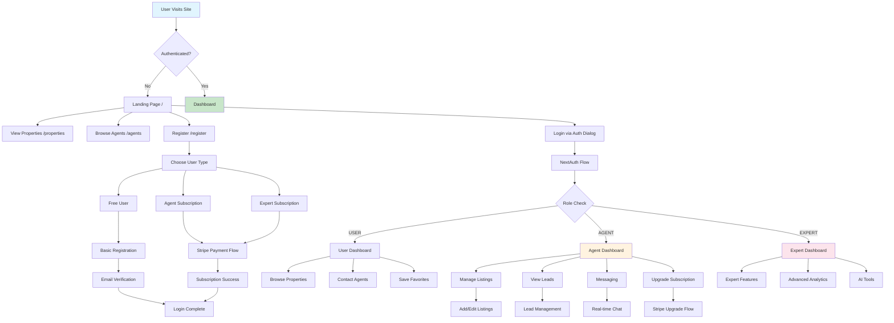

# 📋 Global Real Estate Platform - Complete System Documentation

## 🗺️ Master Flow Chart



## 🛣️ Frontend Routes Map

### Public Routes (No Authentication Required)
| Route | Component | Purpose | Key Features |
|-------|-----------|---------|--------------|
| `/` | `src/app/page.tsx` | Landing page | Property search, hero section, auth dialogs |
| `/properties` | `src/app/properties/page.tsx` | Property listings | Search, filter, view properties |
| `/agents` | `src/app/agents/page.tsx` | Agent directory | Browse agents, contact forms |
| `/blog` | `src/app/blog/page.tsx` | Blog/content | Marketing content (demo) |
| `/pricing` | `src/app/pricing/page.tsx` | Pricing plans | Subscription tiers display |
| `/register` | `src/app/register/page.tsx` | Registration flow | Multi-step registration with payments |
| `/reset-password` | `src/app/reset-password/page.tsx` | Password reset | Token validation and password update |
| `/verify-email` | `src/app/verify-email/page.tsx` | Email verification | Email confirmation flow |

### Protected Routes (Authentication Required)
| Route | Component | Purpose | Role Access | Key Features |
|-------|-----------|---------|-------------|--------------|
| `/dashboard` | `src/app/dashboard/page.tsx` | Main dashboard | ALL | Role-based dashboard display |
| `/profile` | `src/app/profile/page.tsx` | User profile | ALL | Profile management |
| `/settings` | `src/app/settings/page.tsx` | User settings | ALL | Account preferences |

### Agent/Expert Only Routes
| Route | Component | Purpose | Role Access | Key Features |
|-------|-----------|---------|-------------|--------------|
| `/add-listing` | `src/app/add-listing/page.tsx` | Create listings | AGENT, EXPERT | Multi-step property listing creation |

### Expert Only Routes
| Route | Component | Purpose | Role Access | Key Features |
|-------|-----------|---------|-------------|--------------|
| `/expert/dashboard` | `src/app/expert/dashboard/page.tsx` | Expert dashboard | EXPERT | Advanced analytics, tools |
| `/expert/blog` | `src/app/expert/blog/page.tsx` | Blog management | EXPERT | Content creation tools |
| `/expert/social` | `src/app/expert/social/page.tsx` | Social features | EXPERT | Social media management |

### Advanced Feature Routes (Demo/Future)
| Route | Component | Purpose | Access | Status |
|-------|-----------|---------|--------|--------|
| `/ai-matching` | `src/app/ai-matching/page.tsx` | AI property matching | Authenticated | Demo UI |
| `/invest` | `src/app/invest/page.tsx` | Investment platform | Authenticated | Demo UI |
| `/rewards` | `src/app/rewards/page.tsx` | Rewards system | Authenticated | Demo UI |
| `/community` | `src/app/community/page.tsx` | Community features | Authenticated | Demo UI |
| `/forecast` | `src/app/forecast/page.tsx` | Market forecasting | Authenticated | Demo UI |

### Payment/Subscription Routes
| Route | Component | Purpose | Access | Key Features |
|-------|-----------|---------|--------|--------------|
| `/upgrade-success` | `src/app/upgrade-success/page.tsx` | Upgrade confirmation | Authenticated | Post-payment success page |

### Utility Routes
| Route | Component | Purpose | Access | Key Features |
|-------|-----------|---------|--------|--------------|
| `/test-page` | `src/app/test-page/page.tsx` | Testing UI | Development | Component testing |

## 🔗 Backend API Endpoints

### Authentication & User Management
| Endpoint | Method | Purpose | Auth Required | Parameters | Response |
|----------|--------|---------|---------------|------------|----------|
| `/api/auth/[...nextauth]` | GET/POST | NextAuth handler | No | NextAuth flow | Session data |
| `/api/auth/register` | POST | User registration | No | `{email, password, name, role, phone?, agencyName?}` | `{user, message}` |
| `/api/auth/forgot-password` | POST | Password reset request | No | `{email}` | `{message}` |
| `/api/auth/reset-password` | POST | Reset password | No | `{token, password}` | `{message}` |
| `/api/auth/verify-reset-token` | POST | Validate reset token | No | `{token}` | `{valid: boolean}` |
| `/api/auth/send-verification` | POST | Send verification email | No | `{email}` | `{message}` |
| `/api/auth/verify-email` | POST | Verify email | No | `{token}` | `{message}` |
| `/api/auth/socket-token` | POST | Generate Socket.IO token | Yes | None | `{token}` |
| `/api/auth/error` | GET | Auth error handler | No | Query params | `{error}` |

### Property Listings
| Endpoint | Method | Purpose | Auth Required | Parameters | Response |
|----------|--------|---------|---------------|------------|----------|
| `/api/listings` | GET | Get all listings | No | None | `{listings[]}` |
| `/api/listings` | POST | Create listing | Yes (Agent+) | `{title, description, price, currency, location, type, images[], status?}` | `{listing}` |
| `/api/listings/[id]` | GET | Get listing by ID | No | Path: `{id}` | `{listing}` |
| `/api/listings/[id]` | PATCH | Update listing | Yes (Owner/Admin) | `{title?, description?, price?, currency?, location?, type?, status?, images?}` | `{listing}` |
| `/api/listings/[id]` | DELETE | Delete listing | Yes (Owner/Admin) | Path: `{id}` | `{message}` |
| `/api/listings/my-listings` | GET | Get user's listings | Yes (Agent+) | None | `{listings[]}` |

### Lead Management
| Endpoint | Method | Purpose | Auth Required | Parameters | Response |
|----------|--------|---------|---------------|------------|----------|
| `/api/leads` | POST | Create lead/inquiry | Yes | `{agentId, listingId?, message}` | `{lead}` |

### Real-time Messaging
| Endpoint | Method | Purpose | Auth Required | Parameters | Response |
|----------|--------|---------|---------------|------------|----------|
| `/api/conversations` | GET | Get user conversations | Yes | None | `{conversations[]}` |
| `/api/conversations` | POST | Create conversation | Yes | `{otherUserId?, title?, isGroup?, participantIds?}` | `{conversation}` |
| `/api/messages` | POST | Send message | Yes | `{conversationId, content}` | `{message}` |

### Subscription & Payments
| Endpoint | Method | Purpose | Auth Required | Parameters | Response |
|----------|--------|---------|---------------|------------|----------|
| `/api/packages` | GET | Get subscription packages | No | None | `{packages[]}` |
| `/api/stripe/create-checkout-session` | POST | Create Stripe checkout | No | `{priceId, packageId, email, name, successUrl?, cancelUrl?}` | `{url}` |
| `/api/stripe/create-upgrade-session` | POST | Create upgrade checkout | Yes | `{userId, email, priceId, packageId, targetRole, currentRole}` | `{url}` |
| `/api/stripe/webhook` | POST | Stripe webhook handler | No | Stripe event data | `{received: true}` |

### System Health
| Endpoint | Method | Purpose | Auth Required | Parameters | Response |
|----------|--------|---------|---------------|------------|----------|
| `/api/health` | GET | System health check | No | None | `{status, timestamp, uptime, environment}` |

## 📊 Database Schema Overview

### Core Models
```typescript
// User Management
User {
  id: string
  email: string
  name: string
  role: Role (USER | AGENT | EXPERT)
  subscriptionStatus: SubscriptionStatus
  packageId?: string
  // ... auth fields
}

Package {
  id: string
  name: string
  price: number (cents)
  interval: string
  listingsMax: number
  features: string (JSON)
  stripePriceId: string
}

// Property Management
Listing {
  id: string
  agentId: string
  title: string
  description: string
  price: number
  currency: string
  location: string
  type: string
  status: string
}

ListingImage {
  id: string
  listingId: string
  url: string
  sortOrder: number
}

// Lead Management
Lead {
  id: string
  userId: string
  agentId: string
  listingId?: string
  message: string
  status: string
}

Favorite {
  userId: string
  listingId: string
  createdAt: DateTime
}

// Messaging System
Conversation {
  id: string
  title?: string
  isGroup: boolean
  createdAt: DateTime
  updatedAt: DateTime
}

ConversationParticipant {
  id: string
  conversationId: string
  userId: string
  role: string
  joinedAt: DateTime
  leftAt?: DateTime
}

Message {
  id: string
  conversationId: string
  senderId: string
  content: string
  createdAt: DateTime
  readAt?: DateTime
}

// NextAuth Models
Account, Session, VerificationToken
```

## 🔒 Authentication & Authorization Flow

### 1. Registration Flow
```
User fills form → API validates → Creates user → Assigns role → 
Optional payment (Agents/Experts) → Email verification → Login
```

### 2. Authentication Methods
- **Credentials**: Email/password with bcrypt hashing
- **Google OAuth**: via NextAuth Google provider
- **Session Management**: NextAuth JWT + database sessions

### 3. Role-Based Access Control
- **Middleware**: Route protection at `/middleware.ts`
- **API Guards**: Session validation in all protected endpoints
- **UI Guards**: Conditional rendering based on user role

### 4. Permission Matrix
| Feature | USER | AGENT | EXPERT |
|---------|------|-------|--------|
| View properties | ✅ | ✅ | ✅ |
| Contact agents | ✅ | ✅ | ✅ |
| Save favorites | ✅ | ✅ | ✅ |
| Create listings | ❌ | ✅ | ✅ |
| Manage leads | ❌ | ✅ | ✅ |
| Advanced analytics | ❌ | ❌ | ✅ |
| AI tools | ❌ | ❌ | ✅ |

## 🔄 Real-time Features

### Socket.IO Implementation
- **Server**: Custom server with Socket.IO integration
- **Authentication**: JWT token-based socket authentication
- **Features**: Real-time messaging, typing indicators, user presence
- **Endpoints**: Socket token generation at `/api/auth/socket-token`

### Real-time Capabilities
- ✅ Live messaging between users
- ✅ Typing indicators
- ✅ User online status
- ✅ Message delivery confirmation
- 🔄 Push notifications (future)
- 🔄 Live property updates (future)

## 💳 Payment & Subscription System

### Stripe Integration
- **Checkout**: Hosted Stripe checkout sessions
- **Webhooks**: Subscription status updates
- **Packages**: Flexible pricing tiers
- **Upgrades**: Seamless tier upgrades

### Subscription Tiers
1. **Free User** ($0/month)
   - Browse properties
   - Contact agents
   - Basic features

2. **Agent Basic** ($30/month)
   - Create listings
   - Lead management
   - Basic analytics

3. **Agent Standard** ($50/month)
   - More listings
   - Advanced analytics
   - Priority support

4. **Agent Professional** ($100/month)
   - Unlimited listings
   - CRM integration
   - Custom branding

5. **Expert Monthly** ($200/month)
   - All features
   - AI tools
   - Advanced analytics

6. **Expert Yearly** ($1920/year)
   - Expert Monthly + 20% discount

## 🛠️ Technical Stack

### Frontend
- **Framework**: Next.js 14 (App Router)
- **Styling**: Tailwind CSS + shadcn/ui
- **State**: React hooks + NextAuth session
- **Real-time**: Socket.IO client
- **Forms**: React Hook Form + Zod validation

### Backend
- **Runtime**: Node.js
- **Framework**: Next.js API routes
- **Database**: SQLite (Prisma ORM)
- **Authentication**: NextAuth.js
- **Payments**: Stripe
- **Real-time**: Socket.IO
- **Email**: Nodemailer

### Development Tools
- **TypeScript**: Full type safety
- **ESLint**: Code linting
- **Prisma**: Database management
- **Docker**: Containerization ready

## 📈 System Status

### ✅ Completed Features
- User authentication (credentials + Google OAuth)
- Role-based access control
- Property listing CRUD operations
- Real-time messaging system
- Lead management
- Subscription payment system
- Email verification & password reset
- Responsive UI design
- Database schema & API endpoints

### 🔄 In Progress
- Advanced search & filtering
- File upload for property images
- Advanced analytics dashboard
- Mobile app (future)

### 📋 Architecture Benefits
1. **Scalable**: Modular design with clean separation
2. **Type-safe**: End-to-end TypeScript
3. **Real-time**: Built-in messaging capabilities
4. **Payment-ready**: Stripe integration
5. **SEO-friendly**: Next.js SSR/SSG capabilities
6. **Mobile-responsive**: Tailwind CSS design system

This system provides a solid foundation for a real estate platform with room for advanced features and scaling.
